# AI-Monitoring

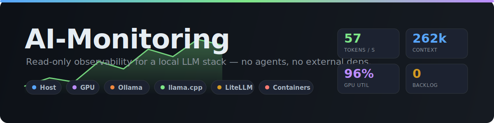

[](https://github.com/tarrinho/ai_monitoring/releases/latest)
[](https://github.com/tarrinho/ai_monitoring/pkgs/container/ai_monitoring)
[](LICENSE)
[](.github/dependabot.yml)
[](https://github.com/tarrinho/ai_monitoring/pkgs/container/ai_monitoring)
[](SECURITY.md)
[](https://claude.com/claude-code)

<!-- Workflow status (CI, CodeQL) + per-control status from the CI workflow, published to the `badges` branch. -->
[](https://github.com/tarrinho/ai_monitoring/actions/workflows/ci.yml)
[](https://github.com/tarrinho/ai_monitoring/security/code-scanning)
[](https://scorecard.dev/viewer/?uri=github.com/tarrinho/ai_monitoring)
[](https://github.com/tarrinho/ai_monitoring/actions/workflows/ci.yml)
[](https://github.com/tarrinho/ai_monitoring/actions/workflows/ci.yml)
[](https://github.com/tarrinho/ai_monitoring/actions/workflows/ci.yml)
[](https://github.com/tarrinho/ai_monitoring/actions/workflows/ci.yml)
[](https://github.com/tarrinho/ai_monitoring/actions/workflows/ci.yml)

**LLM usage, cost, and infrastructure observability for a self-hosted LLM stack.**
Track **spend, token throughput, and per-API-key usage** through **LiteLLM** (🔀),
alongside the **GPU / host / Ollama** () **/ llama.cpp** (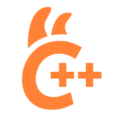) **/ vLLM** () **/ container** health that inference
actually runs on — all in one aiohttp app. Collectors poll each backend's **own native
endpoints** (no Prometheus server, no exporters, no agents), store to SQLite with
tiered rollups, and serve live dashboards that **lead with the cost & usage
numbers**, not just system metrics.

> **What it is / isn't.** AI-Monitoring observes a **self-hosted** LLM stack: LLM
> **spend / tokens / per-key usage** (from LiteLLM's own accounting, at your
> configured per-token model costs) *plus* the infra that serves it. It is **not**
> a third-party **SaaS subscription-billing** tracker — it does not read
> OpenAI/Anthropic plan quotas unless you route those providers *through* LiteLLM,
> in which case their spend shows up like any other key. Per-key **budgets** are on
> the roadmap.

<p align="center">
  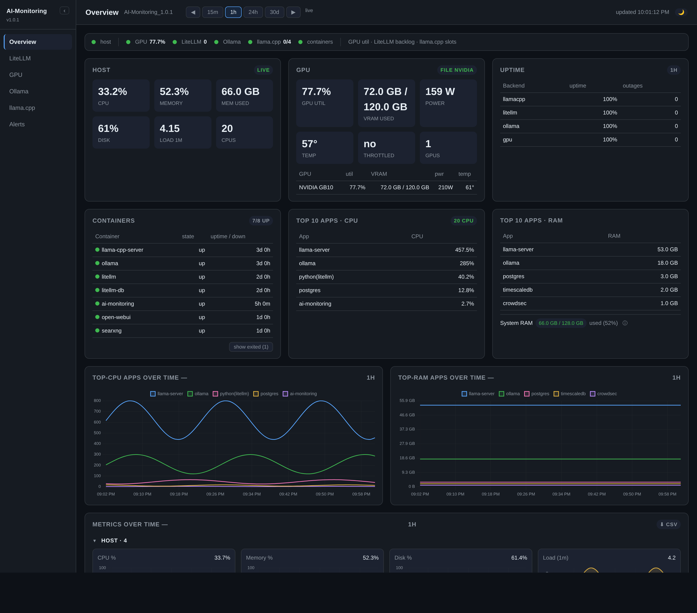
  <br><em>Overview — LLM spend, tokens, and per-key usage up top, then GPU / host /
  containers / top apps, every metric as live time-series.</em>
</p>

### Spend & Quota — the cost-first landing page

<p align="center">
  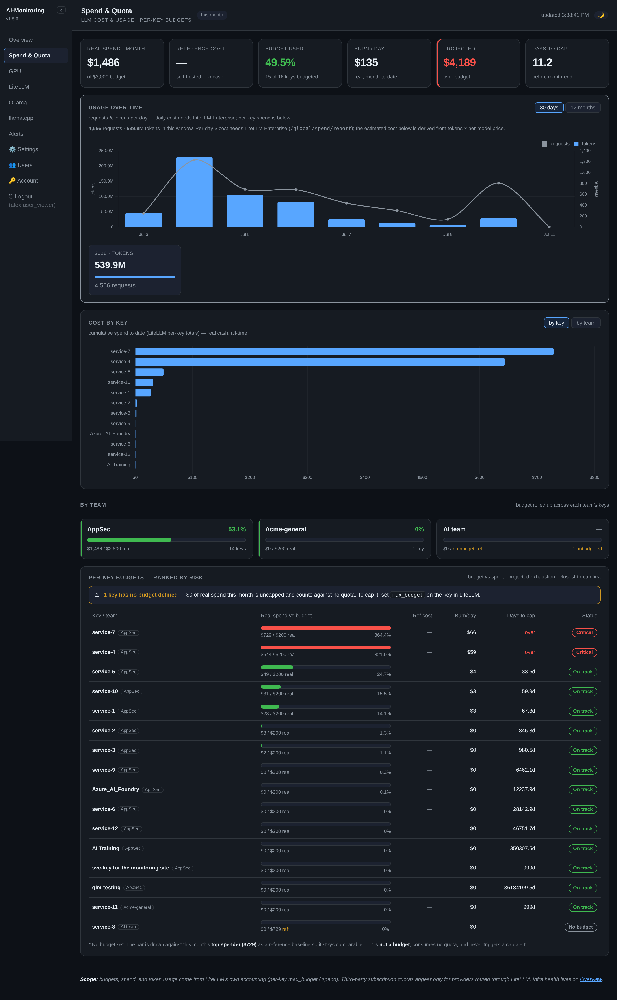
  <br><em>Spend &amp; Quota — LLM cost and usage first: real-cash summary, usage and
  real-vs-estimated cost over time, cost-by-key for every key, by-team rollup, and
  per-key budgets ranked closest-to-cap. (Demo data.)</em>
</p>

`/spend` is where the dashboard leads with **money and usage**, not system metrics.
It reads LiteLLM's own accounting and lays it out top-to-bottom:

- **Cost summary** — total **real cash** this period (external paid models) with the
  self-hosted **estimated** cost shown alongside but kept separate.
- **Usage over time** — requests + tokens as **30-day daily** / **12-month monthly**
  bars, each with **per-year** totals, so growth is visible at a glance. (LiteLLM's
  free tier reports usage, not daily `$`, so the timeline is usage — the `$` split
  comes from the cost chart below.) LiteLLM's free-tier `/global/activity` only serves
  the **last 7 days**, so AI-Monitoring persists each day locally (`spend_daily`,
  captured hourly by the sampler regardless of whether anyone opens the page) and
  serves **stored history ∪ the live window** — the timeline keeps growing past the
  7-day cap.
- **Cost over time** — daily tokens × your per-model price, drawn as **real
  (external)** vs **estimated (self-hosted)** series, per-day accurate (an external
  model's cost lands only on days it actually ran), plus a **current-year cost card**.
- **Cost by key** — cumulative `$` for **every** key (no top-N cap), with a
  **key/team** toggle.
- **By-team rollup** — spend grouped by the teams you assign on the Settings page.
- **Per-key budgets** — `%` used, `$/day` burn, days-to-cap and projected month-end,
  **ranked closest-to-cap first**. Budgets cap **real cash only**; estimated
  self-hosted cost is shown but never consumes a budget.

Because every number here comes from LiteLLM, the page and its sidebar link only
appear when a LiteLLM backend is configured (otherwise `/spend` is hidden and
returns 404).

- **Zero external deps to monitor** — reads `/proc`, Ollama `/api/*`, LiteLLM
  `/spend/logs` + `/health/*`, llama.cpp `/slots`, vLLM `/metrics`, `nvidia-smi`
  (local or over SSH), and the Docker socket (read-only) for container health. aiohttp + a
  couple pure-python libs; nothing else.
- **Ten dashboards** — Overview, LiteLLM, GPU, Ollama, llama.cpp, vLLM,
  Network, Alerts, Spend & Quota, Settings. Collapsible sidebar, day/night,
  time-window + pan, CSV export.
- **Retention up to years** — raw 24h, 1-minute + 1-hour rollups (configurable,
  default 1 year) so charts stay fast and the DB stays bounded.
- **Alerting + anomaly detection** — thresholds, per-key spike/budget detection,
  webhook delivery, live "test" button, persisted history.
- **Hardened + multi-arch** — Alpine base (0 Trivy HIGH/CRITICAL), non-root,
  security headers, constant-time auth, cookie sessions; builds for
  amd64 / arm64 / arm/v7.

---

## Quick start

```bash
cp .env.example .env
$EDITOR .env          # set MONITOR_DASHBOARD_TOKEN + backend URLs
docker compose up -d
# dashboard: http://localhost:9925/?token=<your token>
```

With no backends configured it still runs — host CPU/RAM/disk + top-apps work
standalone, and the LLM/GPU dashboard links hide until their backend is set.

### Verify the image before you run it

Every released image is **cosign keyless-signed** (Sigstore/Fulcio — no long-lived
keys). Signing only helps if you check it, so verify the signature before deploying
— a tampered or unofficial image fails this:

```bash
cosign verify \
  --certificate-identity-regexp \
    "^https://github.com/tarrinho/ai_monitoring/.github/workflows/release.yml@" \
  --certificate-oidc-issuer https://token.actions.githubusercontent.com \
  ghcr.io/tarrinho/ai_monitoring:<tag>
```

It also carries SLSA `provenance` + an SBOM attestation
(`cosign verify-attestation … --type slsaprovenance`), and each GitHub Release
attaches a cosign-signed image manifest (`*.txt` + `*.txt.bundle`).

---

## Dashboards

| Path | Shows |
|------|-------|
| `/spend` (Spend & Quota) | LLM-cost landing: real-cash summary, **usage-over-time** (30d daily / 12mo monthly) with **per-year** totals, **cost-over-time** (**real external vs estimated self-hosted**, per-day accurate + a **current-year cost card**), **cost-by-key** listing **every** key (no top-N cap), **by-team** rollup, and a **per-key budget** table ranked closest-to-cap. Budgets cap real cash; reference/estimated is shown but never consumes budget |
| `/` (Overview) | Host CPU/mem/disk/load, **top-5 apps by CPU & RAM** + per-app evolution, uptime, and all metrics as time-series grouped into collapsible **Host / GPU / LLM** sections |
| `/litellm` | wait avg + **p50/p95/p99 + SLO**, req/s, prompt/completion tok/s, error %, cost/h, **backlog** (in-flight), TTFT, cache hit; per-model table (with p95/SLO); **top-10 keys** (bar + cumulative-over-time + **requests-in-window timeline** = net requests per interval, colored); **failed-request viewer**; **key anomalies**; concurrency-vs-latency |
| `/gpu` | util, VRAM used/%/total, power, temp, throttle, per-GPU table, tokens/watt — local `nvidia-smi`/`rocm-smi` **or a remote GPU box over SSH / HTTP agent** |
| `/ollama` | running/installed models, RAM/VRAM, %-on-GPU, per-model params/quant/unload-countdown, over-time charts |
| `/llamacpp` | tokens/s, active/total slots, busy %, KV-cache %, context size, status, loaded-model card, over-time charts |
| `/vllm` | **running / waiting** requests (queue depth), **GPU KV-cache %**, **TTFT** + per-token latency, prompt/generation token counters and **preemptions** (>0 = vLLM evicting under memory pressure). Read from vLLM's own `/metrics`; with `VLLM_METRICS_ENABLED=0` the page still shows status + loaded model and says why the counters are absent |
| `/network` | host **download / upload speed** + **total downloaded / uploaded** (over the selected time window), per-interface table (speed, lifetime totals, errors, drops) with the busiest NIC marked *primary*. Reads the **host** netns via PID 1 (`/proc/1/net/dev`) — works when the container shares the host PID namespace (`pid: host`, the compose default) or on bare metal; without it the page falls back to the container's own netns and flags the scope as *container* (set `pid: host` to see the host's NICs, or `MONITOR_NET_DEV` to point at a bind-mounted host proc). `NETWORK_IFACES` pins which interface(s) to show (default: physical NICs, skipping loopback / veth / bridges / overlay VPNs) |
| `/alerts` | configured channel, thresholds, active breaches, **"Send test alert"**, fired-alert history |
| `/settings` (admin) | Operator tuning applied **live** (no restart): alerts, sampling, retention, LiteLLM/circuit-breaker knobs — drag-to-arrange cards, layout saved in the DB. A **Teams** board — one line per user (**email · team · per-user budget · keys**), ranked by usage, click a name for **ID · username · email · team · keys**; reassign a key's **team** or **user** as a local override (existing users only; LiteLLM untouched). A **Model costs** board — mark each model **real** (external paid) or **estimated** (self-hosted), driving the Spend cost split |

Common controls on every windowed page: **15m / 1h / 24h / 30d / 12mo** buttons, **◀ ▶
pan** through history, **🌙/☀️ day-night** (persisted), **collapsible sidebar**,
**⬇ CSV** export. A pulsing red dot on the sidebar **Alerts** item appears from
any page when an alert is firing.

### Gallery

<table>
  <tr>
    <td width="50%"><br><sub><b>Spend &amp; Quota</b> — cost summary, usage + real/estimated cost over time, <b>cost-by-key (all keys)</b>, by-team rollup, per-key budgets ranked by risk.</sub></td>
    <td width="50%">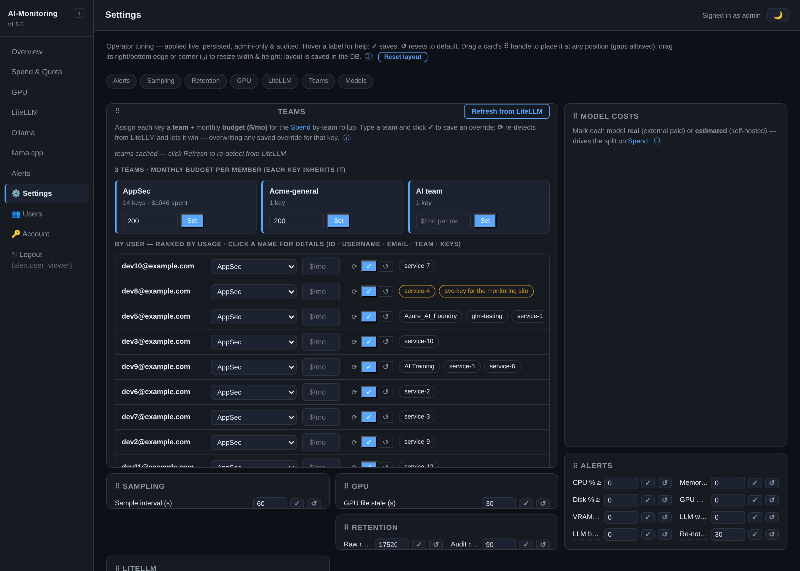<br><sub><b>Settings</b> — live tuning + <b>Teams board</b> (email · team · budget · keys, ranked by usage, click for details) + Model costs. <sub>(demo data)</sub></sub></td>
  </tr>
  <tr>
    <td width="50%">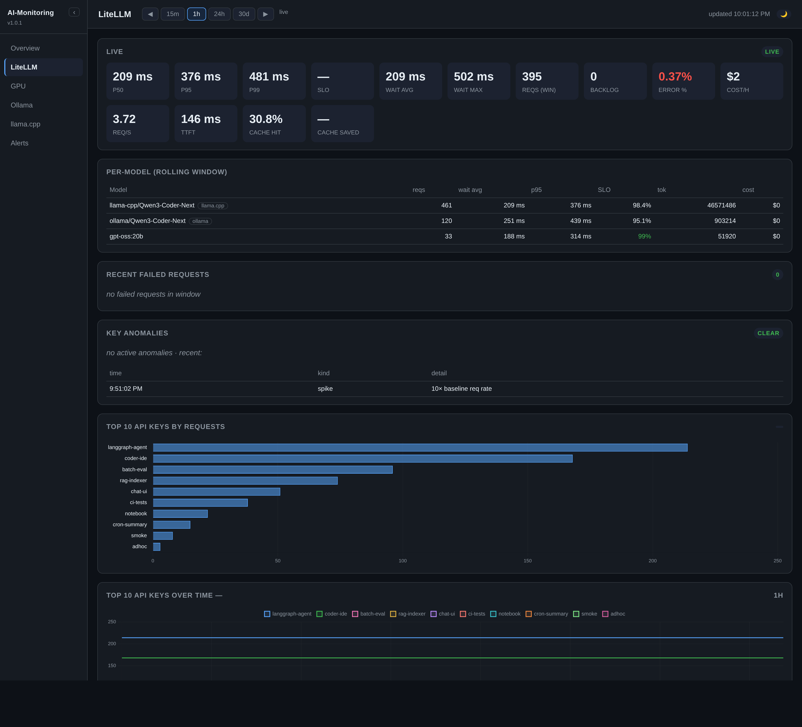<br><sub><b>LiteLLM</b> — latency p50/p95/p99, req/s, cost, backlog, per-model + top keys.</sub></td>
    <td width="50%">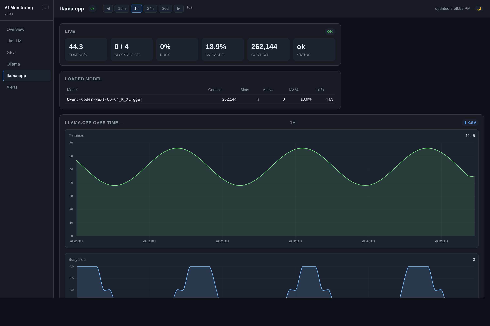<br><sub><b>llama.cpp</b> — tokens/s, slots, KV-cache, context, loaded model.</sub></td>
  </tr>
  <tr>
    <td width="50%">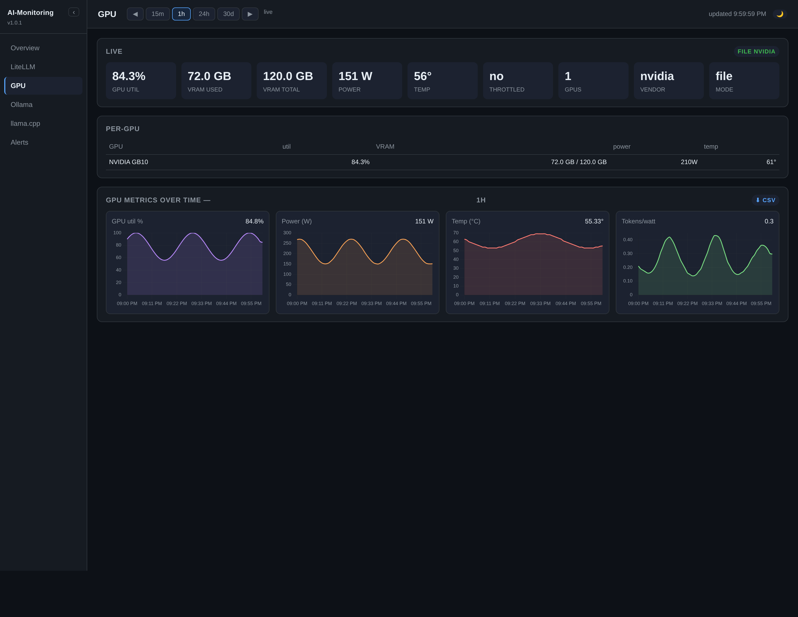<br><sub><b>GPU</b> — util, power, temp, tokens/watt, per-GPU table.</sub></td>
    <td width="50%">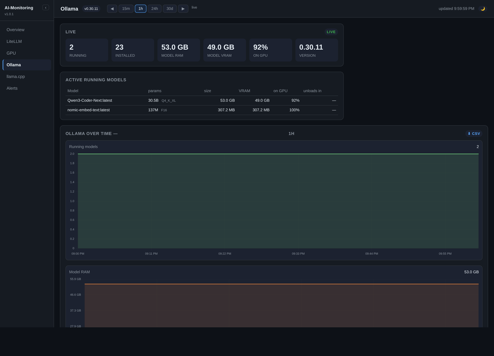<br><sub><b>Ollama</b> — running/installed models, %-on-GPU, RAM/VRAM, unload countdown.</sub></td>
  </tr>
  <tr>
    <td width="50%">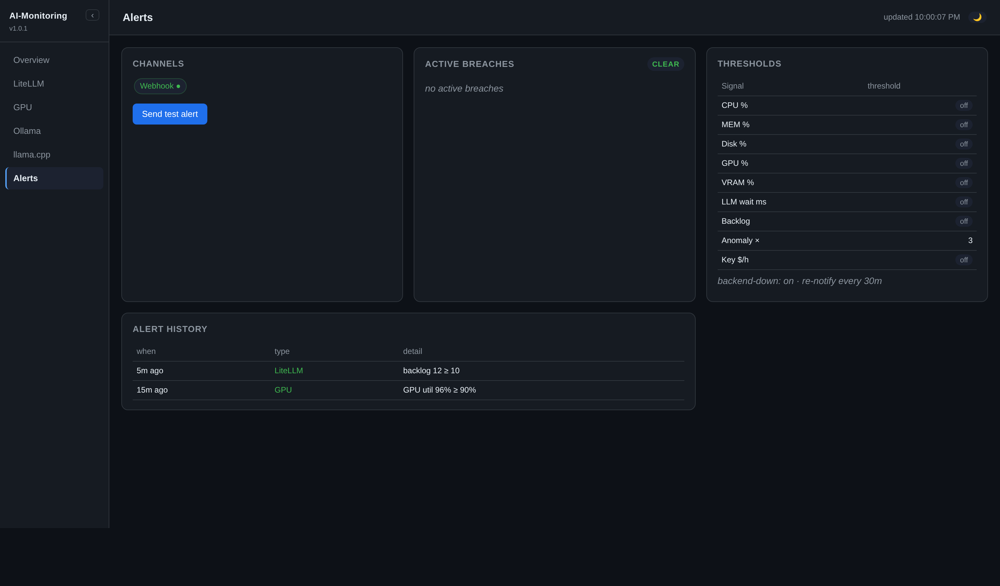<br><sub><b>Alerts</b> — channel, thresholds, active breaches, test button, history.</sub></td>
    <td width="50%">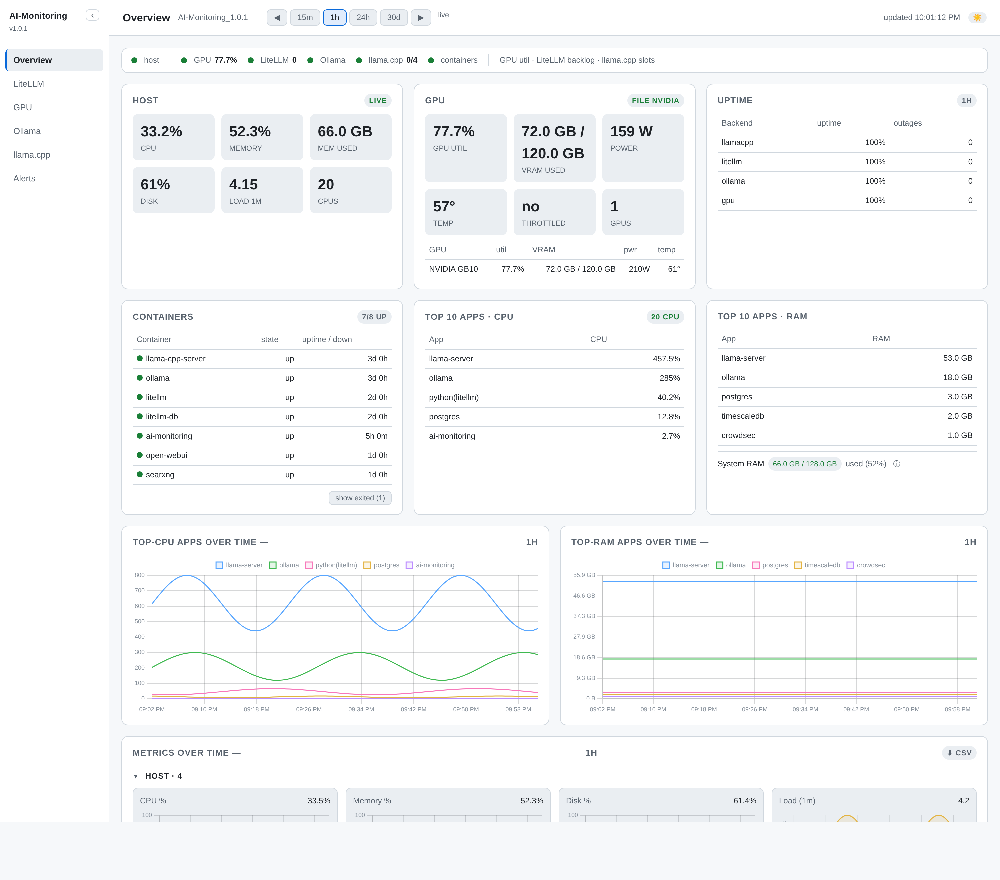<br><sub><b>Light theme</b> — every page is day/night, persisted per browser.</sub></td>
  </tr>
</table>

---

## Configuration (`.env`)

All settings are environment variables (git-ignored `.env`). Fail-fast at boot;
secrets are never logged or persisted. `0` / empty disables a feature.

> **Some settings are also editable in the UI.** Admins can change a curated,
> non-secret subset (alert thresholds, sample interval, retention, and LiteLLM
> spend/SLO/circuit-breaker tuning) on the **Settings** page (`/settings`) — applied
> live and persisted, overriding the `.env` default. Secrets, ports, backend URLs
> and security switches stay env-only. See also **Settings → Teams**: LiteLLM team
> *budgets* are a **LiteLLM Enterprise** feature, so AI-Monitoring lets admins group
> keys into teams (overriding LiteLLM's reported team) for the Spend & Quota
> by-team rollup.

### Core
| Var | Default | Meaning |
|-----|---------|---------|
| `MONITOR_HOST` / `MONITOR_PORT` | `0.0.0.0` / `9925` | listen address |
| `MONITOR_DB_PATH` | `/data/ai-monitoring.db` | SQLite path (on the `/data` volume) |
| `MONITOR_SAMPLE_INTERVAL` | `5` | seconds between samples |
| `MONITOR_HTTP_TIMEOUT` | `4` | per-collector request timeout |
| `MONITOR_DASHBOARD_TOKEN` | *(empty)* | shared **dashboards-only** token (Bearer / `?token=` → cookie); views dashboards but is **not** admin — Alerts + Settings/Users are blocked for it (use a login or admin PAT) |
| `MONITOR_ADMIN_USER` / `MONITOR_ADMIN_PASSWORD` / `MONITOR_ADMIN_EMAIL` | *(empty)* | seed the first **admin** account on an empty users table (idempotent) |
| `MONITOR_SESSION_TTL_S` | `604800` | login session lifetime (seconds; default 7 days) |
| `MONITOR_ALLOW_OPEN` | `0` | `1` = run with **no** auth (loopback / behind an auth proxy only) |
| `MONITOR_RETENTION_SAMPLES` | `8640` | in-memory ring of recent samples (12 h at the 5 s cadence) |
| `MONITOR_HTTP_MAX_BYTES` | `16777216` | hard cap on a single collector response body — stops a compromised/MITM'd backend OOM-ing the monitor |
| `MONITOR_DEBUG` | `0` | `1` = log each collector's availability + error to `docker logs` (diagnose a blank panel) |
| `MONITOR_CURRENCY` | `$` | currency symbol shown before money values on the dashboards |

#### Auth hardening

Brute-force and session limits. The two lockouts are independent: the **per-IP** one stops
a single source spraying tokens, the **per-account** one protects one username even when
the attacker rotates IPs.

| Var | Default | Meaning |
|-----|---------|---------|
| `MONITOR_AUTH_MAX_FAILS` / `MONITOR_AUTH_WINDOW_S` / `MONITOR_AUTH_LOCKOUT_S` | `10` / `300` / `900` | per-**IP** lockout: N bad tokens within the window ⇒ that IP gets `429` for the lockout |
| `MONITOR_AUTH_USER_MAX_FAILS` / `MONITOR_AUTH_USER_LOCKOUT_S` | `10` / `300` | per-**account** lockout, independent of the IP one |
| `MONITOR_AUTH_TRUSTED_PROXY` | `0` | `1` = read the real client IP from `X-Forwarded-For`. **Set this behind a reverse proxy** — otherwise every request looks like the proxy's IP and one attacker locks out all users. Leave `0` when directly exposed (the header is spoofable) |
| `MONITOR_SESSION_MAX` | `2000` | ceiling on concurrent server-side sessions (oldest-expiring evicted) |
| `MONITOR_COOKIE_ALLOW_INSECURE` | `0` | `1` = drop the `Secure` flag on the session cookie — **local plain-HTTP testing only** |
| `MONITOR_SPEND_REQUIRE_ADMIN` | `0` | `1` = restrict `/spend` + `/api/spend/*` to admins (per-user cost attribution includes emails) |

```bash
# behind Caddy/nginx/Cloudflare — trust the forwarded IP so lockouts target real clients
MONITOR_AUTH_TRUSTED_PROXY=1
# the proxy must APPEND to X-Forwarded-For (not replace it); the rightmost hop is trusted
```

### Users & access
External users log in with their own **username + password** instead of sharing a
token. Each account has an email and a role:

- **admin** — full dashboards **+** a *Users* menu (`/admin/users`) to create,
  disable, reset-password, and delete users (viewer or admin).
- **viewer** — read-only dashboards.

Every logged-in user (admin or viewer) can change **their own** password from the
*Account* link (`/account`) — it requires entering the current password to confirm
identity, and signs out their other sessions on success. Admins reset *other*
users' passwords from `/admin/users`.

A user created by an admin (or whose password an admin resets) **must set their own
password on first login**: they are confined to `/account` — every other page and API
is blocked until they choose a new one — and the *Users* table shows a *reset pending*
badge until they do. The env-seeded bootstrap admin is exempt.

Each user can mint **personal API tokens** on `/account` for scripts / the API
(sent as `Authorization: Bearer aimon_pat_…`). A viewer can only create read-only
(viewer) tokens; an admin picks the token's permission (viewer or admin). The secret
is shown once at creation (only its SHA-256 is stored), tokens are revocable, and they
stop working the instant the owner is disabled or deleted.

Each user can also set **their own alert webhook** on `/account` (Slack / Discord /
generic JSON POST) — when an alert fires it is delivered to every enabled user
webhook plus the operator-set global `ALERT_WEBHOOK_URL`. User URLs are SSRF-guarded
(private / loopback / metadata addresses are refused); see
`MONITOR_WEBHOOK_HTTPS_ONLY` / `MONITOR_WEBHOOK_ALLOW_HOSTS` /
`MONITOR_WEBHOOK_ALLOW_PRIVATE`, and `MONITOR_WEBHOOK_MAX_RECIPIENTS` (default `50`)
which bounds the fan-out so one alert can't trigger unbounded outbound requests.

Seed the first admin via `MONITOR_ADMIN_USER` / `MONITOR_ADMIN_PASSWORD` /
`MONITOR_ADMIN_EMAIL`, then manage everyone else from `/admin/users`. Passwords are
scrypt-hashed in SQLite; sessions are HttpOnly + SameSite=Strict + Secure.

**Shared token is dashboards-only.** The `MONITOR_DASHBOARD_TOKEN` rides in the
`?token=` URL and is meant for read-only dashboard sharing, so it is **not** an admin
credential: the **Alerts** and **Settings/Users** links are hidden from it and those
pages/APIs (`/alerts`, `/settings`, `/api/alerts*`, `/api/admin/*`) return **403**.
Anything that needs Alerts or admin — including automation — uses an **interactive
login** or a scoped **admin PAT** (Account → Tokens), not the URL token.

An **audit trail** records logins (success / failure / lockout), logouts, and every
user-management action (create / disable / enable / delete / reset) with actor,
target, and client IP. Admins review it in the *Activity log* on `/admin/users`;
rows are kept for `MONITOR_AUDIT_RETENTION_DAYS` (default 90).

### Backends (each optional)

The self-hosted inference servers AI-Monitoring speaks to natively:

<p>
  
  
  
</p>

_Logos © their respective projects ([Ollama](https://github.com/ollama/ollama), [llama.cpp](https://github.com/ggml-org/llama.cpp), [vLLM](https://github.com/vllm-project/media-kit)) — used to identify the integrations._

| Var | Example | Meaning |
|-----|---------|---------|
| `LITELLM_BASE_URL` / `LITELLM_MASTER_KEY` | `http://host:4000` / `sk-…` | LiteLLM proxy + master key (for `/spend`,`/health`) |
| `LITELLM_SPEND_WINDOW_MIN` | `15` | rolling window for LiteLLM rates/latency |
| `LITELLM_HEAVY_INTERVAL` | `60` | seconds between the **heavy** LiteLLM calls (`/health` probes every deployment; `/spend/logs` pulls the whole day). Cheap signals (liveliness, backlog, models) still refresh every `SAMPLE_INTERVAL`. Raise it to lighten a busy proxy |
| `LITELLM_SPEND_ENABLED` | `1` | `0` = stop pulling `/spend/logs` (drops latency/cost/key panels, keeps cheap backlog/health) — the biggest load-shedder on a very busy proxy |
| `LITELLM_SPEND_MODE` | `full` | `full` = raw `/spend/logs` (latency percentiles, but pulls the whole growing day — heavy). **`lite` = server-side aggregates** (`/global/activity`, `/global/spend/keys`): tiny payloads, **~0 CPU, no freeze**; gives requests/tokens/cost/per-model/top-keys but **no latency**. Recommended on a busy proxy |
| `LITELLM_LOAD_SHED` | `0` | **adaptive kill-switch**: when host 1-min load **per core** ≥ this, the monitor auto-drops the two heavy calls (`/health` + full `/spend/logs`) and resumes when load falls. `0` = off; `~4` = "load is 4× the cores". Cheap calls keep running |
| `LITELLM_SPEND_MAX_ROWS` | `20000` | cap on `/spend/logs` rows parsed per poll (most-recent kept); bounds CPU/memory |
| `LITELLM_SPEND_TIMEOUT` | `20` | timeout (s) for the heavy `/health` + `/spend/logs` calls; the 4s default is too short for a busy proxy's whole-day query and blanks the panels |
| `LITELLM_CB_THRESHOLD` / `LITELLM_CB_COOLDOWN` | `3` / `300` | circuit breaker — after N consecutive heavy-call failures, stop calling for the cooldown (s), then probe once. Stops the monitor hammering (and freezing) a struggling proxy; auto-recovers |
| `LITELLM_SPEND_MAX_BYTES` | `67108864` | refuse a `/spend/logs` response larger than this (bytes) before deserializing |
| `MONITOR_SPEND_ACTIVITY_DAYS` | `1826` | how far back (days) the **Cost over time** card pulls the cheap daily aggregates (one small row/day). The 30d/12mo chart only renders its own window; this reach makes the card's **year-to-date + lifetime** real totals span the deployment's history so they reconcile with per-key spend. Raise it for an install older than ~5y |
| `LITELLM_DEBUG` | `0` | `1` = verbose per-call logging to `docker logs` (diagnose empty panels) |
| `SLO_LATENCY_MS` | `2000` | latency SLO target (% of requests under it) |
| `OLLAMA_BASE_URL` | `http://host:11434` | Ollama (no key needed) |
| `LLAMACPP_BASE_URL` / `LLAMACPP_API_KEY` | `http://host:8080` / *(opt)* | llama.cpp server |
| `VLLM_BASE_URL` / `VLLM_API_KEY` | `http://host:8000` / *(opt)* | vLLM (OpenAI-compatible) server |
| `VLLM_METRICS_ENABLED` | `1` | read vLLM's own `/metrics` for queue depth, KV-cache %, TTFT, throughput and preemptions. Needs **no** Prometheus server/exporter/agent — it is vLLM reporting its own state, like llama.cpp's `/slots`. `0` = JSON endpoints only (status + model, no counters) |
| `GPU_METRICS_FILE` / `GPU_FILE_MAX_AGE` | `/gpu/gpu.csv` / `30` | **LOCAL host GPU, safest**: host writes `nvidia-smi` CSV to a file (see `deploy/gpu-metrics.service`); monitor reads it **read-only** — no SSH/network/shell. Stale file (> max-age) → panel hides |
| `GPU_SSH` / `GPU_SSH_PORT` / `GPU_SSH_KEY` | `user@gpuhost` / `22` / `/keys/id` | **remote** GPU via agentless SSH `nvidia-smi` |
| `GPU_METRICS_URL` | `http://gpuhost:9835/gpu` | **remote** GPU via an HTTP agent returning `{gpus:[…]}` |
| `MONITOR_CONTAINERS` | *(empty = all)* | **Containers** card: liveness + alive-time via the Docker API. **Empty → auto-discovers ALL host containers**; a comma-separated list restricts to those names. Needs the Docker socket mounted (compose does this) + `DOCKER_GID` set to the host `docker` group id so the non-root monitor can read it. **Note:** mounting `docker.sock` grants Docker control — the monitor only issues read-only GETs, but treat it accordingly. |
| `MONITOR_DOCKER_API_URL` | `http://docker-socket-proxy:2375` | **preferred**: reach Docker through a read-only socket **proxy** over TCP. When set, the raw host socket is *not* mounted, so a monitor compromise can't reach the full Docker API |
| `MONITOR_DOCKER_SOCKET` | `/var/run/docker.sock` | legacy direct-socket fallback, used only when `MONITOR_DOCKER_API_URL` is empty |

*(No GPU vars → local `nvidia-smi`/`rocm-smi`; no GPU present → the GPU dashboard hides.)*

#### Cost attribution & pricing

How a model's spend is classified and priced. **REAL** = external cash that counts against a
budget; **REFERENCE** = self-hosted, an imputed value shown but never billed.

| Var | Example | Meaning |
|-----|---------|---------|
| `MONITOR_INTERNAL_PROVIDERS` | `ollama,llamacpp,vllm,…` | provider prefixes treated as **self-hosted** (reference cost). Set **empty** if you price local models yourself and want them counted as real budgetable spend |
| `MONITOR_INTERNAL_MODEL_FAMILIES` | `gemma,qwen,mistral,llama,…` | open-weight **families** that are self-hosted even without a provider prefix (a bare `qwen2.5`). Matched as a substring of the model name |
| `MONITOR_MODEL_COSTS` | `{"provider/model": 0.20}` | per-model price override in **USD per 1M tokens** — highest precedence, pins a model's rate when LiteLLM's own price is wrong (e.g. it ignores a cache-read discount) |
| `MONITOR_KEY_BUDGETS` | `{"team-a-key": 500}` | per-key **monthly** budgets, used until a real `max_budget` is read from LiteLLM `/key/info` |
| `MONITOR_SPEND_MU_BACKFILL_DAYS` | `14` | one-time seed for the *cost per model & user* chart: days of `/spend/logs` history to backfill on first run (`0` = none, chart grows forward) |

```bash
# Price two external models yourself (USD per 1M tokens) and cap two keys per month.
# Keep REAL figures in your own .env — never commit them.
MONITOR_MODEL_COSTS='{"azure/gpt-4o-mini": 0.15, "anthropic/claude-sonnet": 3.00}'
MONITOR_KEY_BUDGETS='{"team-research": 500, "team-support": 150}'

# Treat a bare open-weight model as self-hosted (reference cost, never billed):
MONITOR_INTERNAL_MODEL_FAMILIES=gemma,qwen,mistral,llama
```

### GPU setup

The monitor runs on Alpine and **can't run a passed-through `nvidia-smi`**, so it
never touches the GPU directly. Pick **one** of three ways to feed it GPU metrics:

**Mode 0 — local host GPU via a file (recommended, safest).** The host writes
`nvidia-smi` CSV to a file on a timer; the monitor bind-mounts it **read-only** —
no SSH, no network, no shell into the host.

```bash
# on the GPU host:
sudo mkdir -p /var/lib/aimon-gpu && sudo chmod 755 /var/lib/aimon-gpu
sudo install -m 0755 deploy/gpu-metrics-writer.sh /usr/local/bin/aimon-gpu-writer.sh
sudo cp deploy/gpu-metrics.service /etc/systemd/system/
sudo systemctl enable --now gpu-metrics.service      # writes /var/lib/aimon-gpu/gpu.csv
```
```yaml
# in the monitor's docker-compose.yml:
    volumes:
      - /var/lib/aimon-gpu:/gpu:ro
```
```bash
# in .env:
GPU_METRICS_FILE=/gpu/gpu.csv        # GPU_FILE_MAX_AGE=30 → stale file hides the panel
```

**Mode 1 — remote GPU over SSH** (agentless): `GPU_SSH=user@gpuhost` +
`GPU_SSH_KEY=/keys/id` (mount the key). The monitor runs `nvidia-smi` over SSH.

**Mode 2 — remote GPU over HTTP**: `GPU_METRICS_URL=http://gpuhost:9835/gpu`, an
endpoint returning `{"gpus":[{util,vram_used,vram_total,power,temp,…}]}`.

> **Unified-memory GPUs (e.g. NVIDIA GB10 / DGX Spark):** `nvidia-smi` reports no
> separate VRAM, so **VRAM tiles/charts are intentionally hidden** — util, power,
> temperature and tokens/watt still work. This is expected, not a misconfiguration.

### Alerting (threshold `0` = off)
| Var | Default | Fires when |
|-----|---------|-----------|
| `ALERT_CPU_PCT` / `ALERT_MEM_PCT` / `ALERT_DISK_PCT` | `0` | host CPU / mem / disk % ≥ value |
| `ALERT_GPU_PCT` / `ALERT_VRAM_PCT` | `0` | GPU util / VRAM % ≥ value |
| `ALERT_LLM_WAIT_MS` / `ALERT_BACKLOG` | `0` | LiteLLM avg wait / in-flight backlog ≥ value |
| `ALERT_VLLM_WAITING` | `0` | vLLM **queued** requests ≥ value. `running` means busy; `waiting` means requests are queuing — the saturation signal |
| `ALERT_ON_BACKEND_DOWN` | `1` | a configured backend goes down |
| `ALERT_REPEAT_MIN` | `30` | cooldown before a still-firing alert re-notifies |
| `ALERT_WEBHOOK_URL` | *(empty)* | delivery target — `POST {source, text}` |

### Per-key anomaly / abuse detection (`0` = off)
| Var | Default | Meaning |
|-----|---------|---------|
| `ANOMALY_FACTOR` | `4` | alert when a key's recent req-rate ≥ N× its hourly baseline |
| `ANOMALY_MIN_REQS` | `20` | ignore keys below this many reqs (noise floor) |
| `ANOMALY_KEY_BUDGET_HR` | `0` | alert when a key's spend exceeds $/hour |

### Retention (tiered rollups)
| Var | Default | Keeps |
|-----|---------|-------|
| `ROLLUP_RAW_HOURS` | `24` | raw 5-second samples + per-key/app detail |
| `ROLLUP_MIN_DAYS` | `30` | 1-minute averaged rollups |
| `ROLLUP_HOUR_DAYS` | `365` | 1-hour averaged rollups (the long horizon) |
| `MONITOR_DB_RETENTION_HOURS` | `720` | full JSON snapshots |

Charts pick the tier by window: raw ≤1h, 1-min ≤24h, 1-hour beyond. Aggregation
is bounded to recent rows, so retention length doesn't affect per-tick cost.
Steady-state size ≈ a few hundred MB at 1 year; set the rollup days higher for
multi-year (e.g. `ROLLUP_HOUR_DAYS=730`).

---

## Deployment

### Prometheus metrics & Grafana

`GET /metrics` exposes `aimon_*` gauges in Prometheus text format (host CPU/mem/disk,
per-GPU util/power/temp/VRAM, `aimon_backend_up`, LiteLLM req/token/cost/latency,
llama.cpp tokens/s + KV-cache, per-container up, top-N process CPU, user/session/alert
counts). Point any Prometheus/Grafana/Datadog/AlertManager at it:

```yaml
# prometheus.yml
scrape_configs:
  - job_name: ai-monitoring
    authorization: { credentials: "<MONITOR_METRICS_TOKEN>" }
    static_configs: [{ targets: ["ai-monitoring:9925"] }]
```

`/metrics` is gated like the API — a session, the dashboard token, or a dedicated
scrape-only `MONITOR_METRICS_TOKEN` (recommended; least privilege). Disable with
`MONITOR_METRICS_ENABLED=0`. A ready-made dashboard ships at
`deploy/grafana/ai-monitoring-dashboard.json`.

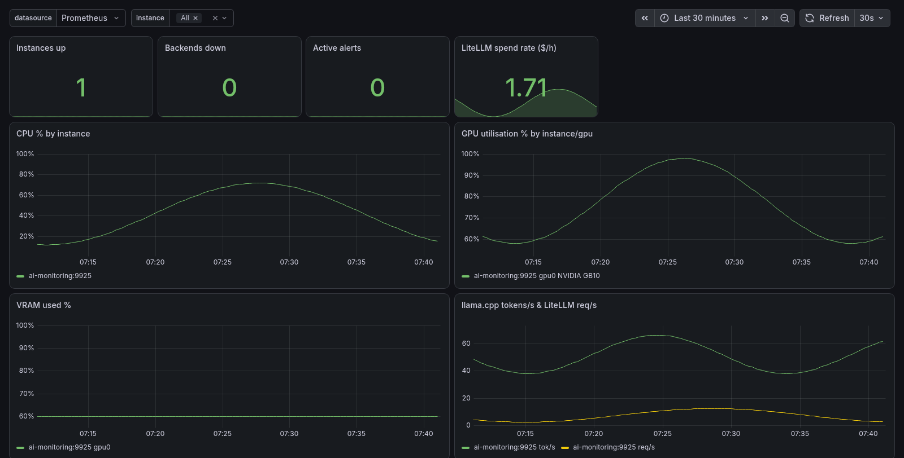
<sub>The shipped Grafana dashboard aggregating a fleet via `/metrics` — Prometheus scrapes each instance.</sub>

### Kubernetes / multi-node fleet

Run it centrally or **one pod per node** and let a central Prometheus aggregate the
whole fleet (per-node agent + central Prometheus/Grafana — the same pattern DCGM uses).

```bash
# Helm (central Deployment)
helm install aimon deploy/helm/ai-monitoring \
  --set secret.data.MONITOR_ADMIN_PASSWORD=<pw> --set serviceMonitor.enabled=true
# Helm (per-node DaemonSet, host + GPU metrics)
helm install aimon deploy/helm/ai-monitoring --set mode=daemonset \
  --set daemonset.gpuMetricsFile=/var/lib/aimon-gpu --set serviceMonitor.enabled=true
# or plain manifests
kubectl apply -f deploy/k8s/ai-monitoring.yaml    # central; add daemonset.yaml for per-node
```

The chart creates a Service, PVC (Deployment) or emptyDir (DaemonSet), a Secret, and
an optional **ServiceMonitor** (Prometheus Operator) that scrapes `/metrics` with the
metrics token. Import the Grafana dashboard and select the `instance` variable.

A ready-to-run demo stack (AI-Monitoring + Prometheus + Grafana, auto-provisioned) is in `deploy/prometheus-example/` — `cd` there and `docker compose up -d`.

### Docker Compose (default)
```bash
docker compose up -d          # builds locally, runs the QA gate, serves :9925
```
`pid: host` (in compose) lets the top-apps view see host processes.

### Multi-arch (amd64 / arm64 / arm/v7)
Pure-python → one Alpine Dockerfile serves all arches.
```bash
docker run --privileged --rm tonistiigi/binfmt --install arm   # one-time (armv7 QEMU)
deploy/build-multiarch.sh                                       # builds + Trivy-scans all three
```
arm64/amd64 run the full pytest gate natively; armv7 builds emulated with
`RUN_TESTS=0` (already validated on the native arch).

### Ship a pre-built image to a server (no registry)
```bash
docker save ai-monitoring:1.8.5-armv7 | gzip > aimon.tar.gz
scp aimon.tar.gz deploy/docker-compose.server.yml .env.example user@server:~/aimon/
# on the server:
docker load < aimon.tar.gz && docker tag ai-monitoring:1.8.5-armv7 ai-monitoring:1.8.5
mv docker-compose.server.yml docker-compose.yml && cp .env.example .env  # fill in
docker compose up -d
```

### Behind a reverse proxy at a sub-path
The app honours `X-Forwarded-Prefix`, so it can live under a path (not just its
own vhost). Apache example — serve it at `https://host/ai_monitoring/`:
```apache
ProxyPreserveHost On
RequestHeader set X-Forwarded-Proto  "https"
RequestHeader set X-Forwarded-Prefix "/ai_monitoring"
ProxyPass        /ai_monitoring/ http://127.0.0.1:9925/
ProxyPassReverse /ai_monitoring/ http://127.0.0.1:9925/
```
The proxy strips the prefix (app routes stay unprefixed); the app rewrites the
absolute links/fetches in its HTML + the auth cookie-redirect to include it. No
header → served at root, unchanged. Requires `MONITOR_HOST=0.0.0.0` in `.env` so
Docker's port-forward reaches the app (binding container-loopback makes the
published port reset the connection).

### Public tunnel + boot autostart
- `deploy/tunnel.sh [ngrok|cloudflared]` — persistent tunnel via a `systemd --user`
  unit (survives shell exit), prints the URL.
- `deploy/ai-monitoring.container.service` — systemd unit to auto-start on boot.

---

## Local test environment

`test-env/` spins up **real** backends for the monitor to read:
```bash
docker compose -f test-env/docker-compose.yml up -d   # Ollama + LiteLLM + Postgres (+ traffic gen)
docker exec aimon-ollama ollama pull qwen2.5:0.5b
```
Loopback-bound, secrets in a git-ignored `test-env/.env`. Point the monitor's
`.env` at `http://litellm:4000` / `http://ollama:11434` (shared network) or the
localhost ports.

---

## API

All gated by the dashboard token when set; `/healthz` is always open.

| Endpoint | Returns |
|----------|---------|
| `GET /api/data?history=N` | latest snapshot + recent samples |
| `GET /api/series?window=&end=` | downsampled metric series (panning via `end`) |
| `GET /api/keyseries?window=&end=` | top-10 API keys over time (multi-line) |
| `GET /api/procseries?kind=cpu\|ram&window=&end=` | top-5 apps over time |
| `GET /api/uptime?window=` | per-backend uptime % + transition events |
| `GET /api/anomalies` | active + recent per-key anomalies |
| `GET /api/alerts` · `POST /api/alerts/test` | channels/thresholds/active/history · fire a test |
| `GET /api/nav` | which backend dashboards are configured (nav visibility) |
| `GET /api/export?window=&format=csv\|json` | export a window |
| `GET /healthz` | liveness (container probe) |

---

## Architecture

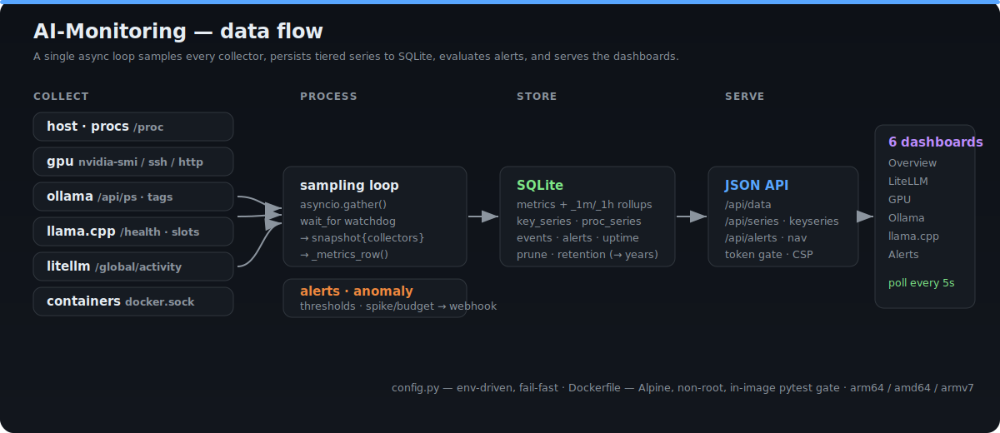

See [ARCHITECTURE.md](ARCHITECTURE.md). In short: the fast collectors (`host`,
`procs`) are awaited on a 5s tick, while every heavy backend polls on its own
`wait_for`-bounded loop into a `_backend_latest` cache — so a wedged backend can
never stall sampling. The tick flattens a snapshot into numeric metric columns
+ per-key/per-app series, writes SQLite (with incremental rollup + tiered prune),
evaluates alerts + anomalies through a debounced webhook notifier, and serves
eight dashboards which read the JSON API over SSE (`/api/stream`) with a 5s poll
fallback.

```
app.py           aiohttp app: tick + per-backend loops, auth, security headers
config.py        env-driven config (fail-fast)
db.py            SQLite: metrics + rollups, key/proc series, events, alerts, uptime
alerts.py        threshold eval + webhook notifier (debounce + recovery + history)
anomaly.py       per-key spike / budget detection
collectors/      host, procs, gpu, litellm, ollama, llamacpp, containers
web/             eight dashboards (overview, litellm, gpu, ollama, llamacpp,
                 alerts, spend & quota, settings)
deploy/          multi-arch build, tunnel, systemd, server compose
test-env/        real Ollama + LiteLLM + Postgres for integration
tests/           full QA suite (static + dynamic + live-integration)
```

---

## Security

- **Auth**: optional dashboard token — constant-time compare, HttpOnly
  `SameSite=Strict` cookie session (token leaves the URL after first load).
- **Privilege tiers**: the shared URL token is **dashboards-only** (Alerts +
  Settings/Users blocked, `403`); **Alerts** and **admin** require an interactive
  login (viewer / admin role) or a scoped **admin PAT** — the shared secret can't
  reach sensitive config.
- **Headers**: `X-Frame-Options: DENY`, CSP `frame-ancestors 'none'`, nosniff,
  no-referrer, server-version hidden.
- **XSS**: every dynamic value HTML-escaped; single DOMPurify-sanitised
  `innerHTML` sink per page; tracked timers.
- **SSRF**: GPU-agent fetch restricted to `http(s)`, bypasses proxy env.
- **Secrets**: env-only, git-ignored, never logged or stored; boot banner
  redacts. Container runs **non-root** on **Alpine** (0 Trivy HIGH/CRITICAL).
- **Error logging**: every error is recorded to the server's stderr (`docker logs`)
  — failed/locked-out logins (with user + IP), denied writes (`4xx`), and unhandled
  exceptions (`500` + traceback); normal `200` traffic is never logged.
- **Forced first-login reset**: admin-created / admin-reset accounts must set their
  own password before reaching anything else (see *Multi-user access* above).

To report a vulnerability, see [`SECURITY.md`](SECURITY.md) — please report
privately (GitHub Security tab → *Report a vulnerability*), never as a public issue.

---

## Testing

`pytest tests/` — static (source/dashboard/Dockerfile invariants) + dynamic
(collectors vs stub servers, endpoints, DB rollup/pan/retention) + live
(real test-env, auto-skipped when down). **The Docker build runs the full suite
as a gate** — a failing test aborts `docker build` before an image exists.
```bash
pip install -r requirements-dev.txt && pytest
```

## Development

This project was built with AI assistance (Claude Code). All code is human-reviewed and
gated by an extensive CI pipeline that runs on every push: 600+ tests, ruff / semgrep /
bandit static analysis, gitleaks + trufflehog secret scanning, Trivy CVE scans
(filesystem + image), and cosign image signing.

## License

This project is licensed under the Apache License 2.0.

You are free to use, modify, and distribute this software, including for
commercial purposes, under the terms of the license.

See the [LICENSE](LICENSE) file for full details.
